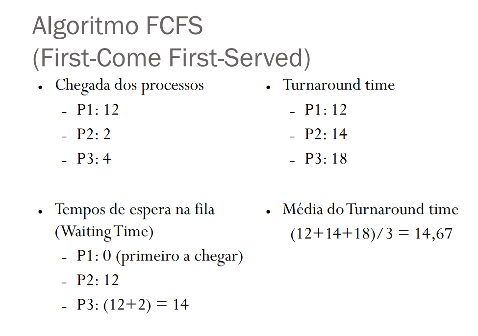

# Aula - 21/09/2017

# Sistemas preemptivos 
    * A preempção é uma característica que permite que um processo que está em execução pode ser
    pasado para o estado de pronto para que outro começe a executar;
    * Estes tipos de sistemas são mais complexos, porém, permitem uma maior flexibilidade na criação
    das políticas de escalonamento;

    OBS: 
        * Execução para espera -> Ele pediu para ficar em espera;
        * Execução para pronto -> Preempção;

# Sistemas Não-preemptivos

* Sistemas que não conseguem parar no meio da execução de processos para executar outros:
    * Um exemplo são os sistemas Batch;
    * A mudança só ocorre se o programa tiver estruções para realizar tal feito, ou, até que o sistema operacional 
    finalize todo o processamento; 

# Deadlock

* Problema que ocorre quando todos os processos estão esperando algum recurso que está sendo utilizado por outro processo.

# Starvation

* Processo que nunca entra em execução por falta de disponibilidade de recursos.

# Quantum

* Este é o tempo atribuido para algum processo ser executado.

# Overhead

* É a alocação de recursos em excesso feitas por algum processo

# Tempo de turnaround

* Este é o tempo que o processo leva desde sua criação até seu término, levando em consideração todo o tempo gasto com alocação de memória e recursos, espera, processamento. As politicas de escalonamento tentam diminuir este número

# Algoritimos de escalonamento de processos

* FIFO (First In, Firts Out)
    * O primeiro que chega na fila, será o primeiro a ser executado;
    * Nas filas, há aqueles responsáveis pelos processos em espera e aquelas pelos processos em execução;
    * Neste algoritimo os processos de I/O Bound são afetados por passarem boa parte do tempo em espera,
    e quando vão ser executados tem sempre alguém na frente, o que pode causar grandes problemas.

* Shortest job first (SJF):
    * O processo que consumir o menor tempo, será o primeiro a ser executado;
    * É uma forma de escalonamento não-preemptivo;
    * Sua forma preemptiva é conhecida como shortest remaining time (SRT schudeling).

    * OBS: Este tempo é calculado através de uma estimativa feita pelo sistema operacional.

* Circular (Round Robin):
    * O escalonamento circular utiliza do conceitos de filas (FIFO) para trabalhar, porém neste caso o conceito de tempo é aplicado, ou seja, cada processo tem uma fatia de tempo para ser executada, e caso expire, o processo volta para o final da fila;
    * Neste caso os processos I/O bound tem desvantagens e podem apresentar problemas;
    * Este processo também é conhecido como Quantum ou Round Robin.
* Prioridades:
    * Este é um escalonamento que realiza as decisões com base no valor da prioridade de execução , o processo com maior prioridade na fila para a execução sempre é o primeiro a ser escolhido.
    * Caso haja escalonamento entre processos de mesma prioridade, o que irá valer será quem está na fila a mais tempo.
* Circular com prioridade:
    * Este escalonamento implementa os conceitos do circular e de prioridade. Porém nesta forma de escalonamento o processo fica em execução até que termine seu processamento, passe para o estado de espera ou sofra uma preempção por tempo ou prioridade;
    * Aqui as filas são priorizadas, e internamente a essas filas, há filas circulares.
* Multiplas filas:
    * Neste tipo de escalonamento há várias filas, cada uma com uma priorídade diferente;
    * Aqui os processos são associados a certas filas de acordo com suas características, como 
    a importáncia, a área de memória que será utilizada, entre outros. Com isso, é possível selecionar
    qual será a lista (Existem várias, com várias prioridades, como visto acima) selecionada;
    * Tem a vantagem de permitir diversos escalonadores, isso porque nem todos os tipos de processos 
    se adequam a todos a certos escalonamentos, assim, cada fila tem um escalonador, sendo eles FIFO ou circular;
    * O processo não tem prioridade, esta fica a cargo das filas;

# Exercícios

Exercícios do 12 ao 18

<code>12</code> - Pasta com a solução <code>atividade_12-page_152</code>

<code>13</code>
* a-) Em que tempos A sofre preempção ?
    * R: Nos tempos 25-29, 55-59
* b-) Em que tempos B sofre preempção ? 
    * R: Nunca, pois o processo B tem prioridade maior que o processo A
* c-) Refaça a tabela anterior supondo que o processo A é mais prioritário que o processo B
    * R: Resposta na pasta <code>atividade_13-c_page_153</code>

<code>14</code>
* R: Quanto maior é o quantum, menor será o número de preepções, e isso acaba afetando todo o 
sistema multiprogramado, este caso favorece os processos CPU Bound e deixa de lado os processos I/O Bound. Caso o valor seja muito pequeno, ocorrerá o problema de OverHead, já que em curtos espaços de tempo, haverão muitas trocas de contexto e alocação de novos recursos

<code>15</code>
* a-) T = 8.ut
    * P1: Executando;
    * P2: Pronto;
    * P3: Pronto.

* b-) T = 11 u.t
    * P1: Pronto;
    * P2: Executando;
    * P3: Pronto.

* c-) T = 33 u.t
    * P1: Finalizado;
    * P2: Finalizado;
    * P3: Executando.

<code>16</code>
* a-) T = 8 u.t
    * P1: Espera
    * P2: Em execução
    * P3: Pronto
* b-) T = 18 u.t
    * P1: Em execução
    * P2: Finalizado
    * P3: Em espera
* c-) T = 28 u.t
    * P1: Em espera
    * P2: Finalizado
    * P3: Em execução

<code>17</code>
P1 - 9
P2 - 6
P3 - 3
P4 - 5

P3, P4, P2, P1, esta ordem evita e diminui o processo de Turnarround. Esta escolha foi feita utilizando a forma de escalonamento SJF

<code>18</code>

O exercício 18 utilizou o seguinte conceito para a solução do problema

* a-) FIFO
    * 0 u.t
        *  1° - 40 
        *  2° - 20
        *  3° - 50
        *  4° - 30 
        * R: (40 + 20 + 50 + 30) / 4 = 35

    * 5 u.t
        * 1° - 40 
        * 2° - 20 + 45 = 65
        * 3° - 50 + 70 = 120
        * 4° - 30 + 125 = 150
        * R: (40 + 65 + 120 + 150) / 4 = 93

* b-) SJF
    * 0 u.t 
        * P2: 20
        * P4: 30 + 20 = 50
        * P1: 40 + 50 = 90
        * P3: 50 + 90 = 140
        * R: 75
    * 5 u.t
        * P2: 20
        * P4: 30 + 25 = 55
        * P1: 40 + 60 = 100
        * P3: 50 + 100 = 150
        * R: 81

* c-) Circular com fatia de tempo igual a 20 u.t

* d-) Prioridades
    * 0 u.t
        * P3: 50
        * P2: 20 + 50 = 70
        * P4: 30 + 70 = 100
        * P1: 40 + 100 = 140
        * R: 310
    * 5 u.t
        * P3: 50
        * P2: 20 + 55 = 75
        * P4: 30 + 80 = 110
        * P1: 40 + 115 = 155
        * R: 97