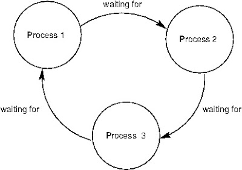

# Aviso

Aqui há apenas resumos dos cápitulos, que foram escritos durante os estudos. Assim é recomendado que para utilizar o resumo, já se tenha lido o livro, ou esteja familiarizado com a matéria, já que este é a simplificação do conteúdo.

## Status do documento

Status atual do conteúdo: Incompleto

## ROADMAP - Sistemas operacionais 

ROADMAP para prova de sistemas operacionais

### Leitura do livro - Arquitetura de Sistemas Operacionais 4ª Edição

Fazer a leitura dos seguintes capitulos

* Parte 1 - Conceitos básicos;
* Parte 2 - Conceitos de hardware e software;
* Parte 3 - Concorrência;
* Parte 4 - Estrutura do sistema operacional;
* Parte 5 - Processos;
* Parte 6 - Threads;
* Parte 7 - Sincronização e comunicação entre processos;
* Parte 8 - Gerência do processador.

### Exercícios

A leitura é importânte, porém para a fixação dos conceitos é necessário fazer todos os exercícios, abaixo vou listar os principais:

* Página 22 e 23 - Exercícios 4, 14, 18, 19 e 20;
* Página 39 - Exercícios 2, 6, 8 e 10;
* Página 62 - Exercícios 1, 2, 4, 5, 6 e 8;
* Página 84 - Exercícios (1, 2, 3), 4, (5, 6), 9;
* Página 84 - Exercícios 10, 11, 13, 14, 15;
* Página 94 - Exercícios 1, 2, 3;
* Página 152 - Exercícios 12 a 18.

#### Laboratórios

Além dos exercícios na aula de processos, há um exercício lab para ser feito.

* Página 84 - Laboratório com SOSim - Atividade 1 e 2

### Parte 1 -  Conceitos Básicos

* O que é um Sistema Operacional ?
  
  Sistema Operacional, resumidamente é apenas um conjunto de rotinas executado pelo processador, podemos dizer que é semelhante aos programas dos usuários. Sua principal função é controlar o funcionamento de um computador, gerenciando a utilização e o compartilhamento dos seus diversos recursos, como processadores, memrias e dispositivos de entrada e saída
  
* Tipos de Sistemas Operacionais
  
  * Sistemas Monoprogramáveis / Monotarefa
 
    Foram os primeiros sistemas operacionais. São sistemas que pode-se executar apenas um programa por vez, para que outra aplicação fosse executada, deveria aguardar o término do programa corrente. Processador, memria e periféricos são de total exclusividade a execução de um único programa.
 Sua implantação é extremamente simples, não existindo preocupação no compartilhamento de recursos, tais como memória, processador e dispositivos E/S
         
  * Sistemas Multiprogramáveis / Multitarefa
  
      Uma evolução dos antigos sistemas monoprogramáveis, aqui é diferente, os recursos computacionais são compartilhados entre aplicações e usuários. Enquanto um simples programa espera para ler ou gravar algo em disco, outros programas estão sendo processados no mesmo intervalo de tempo. O S.O se preocupa em gerenciar o acesso concorrente aos diversos recursos, de maneira ordenada e protegida. Suas vantagens: custo reduzido, redução total de tempo de execução dos programas. Desvantagens: mais complexo a implementação.
      
  * Ele pode ser dividido em três sistemas: batch, tempo compartilhado e tempo real.
   
      * Sistema Batch:
   
        * Primeiros tipos de sistema operacionais multiprogramáveis. Os programas(jobs) eram submetidos para execução usando           cartes perfurados e armazenados em disco ou fita, sendo guardados para serem processados. Os jobs eram executados,           produzindo uma saída em disco ou fita.
        Ele não exige interação do usuário com a aplicação. Entradas e saídas de dados implementadas por memória                     secundária(geralmente arquivos em disco)
        Quando bem projetados são eficientes, já que utilizam melhor o processador, só que o tempo de resposta pode ser               longo.
        Exemplo de aplicações: envolvendo cálculos numericos, compilações, ordenações, backups e outros que não é necessário         o usuario.
  
        * Sistemas de tempo compartilhado
  
          Os sistemas de tempo compartilhado, permitem que diversos programas sejam executados em pequenos intervalos definidos pelo sistema operacional.
          Esta forma de trabalho é bastante utilizada pelas aplicações corporativas, por oferecerem tempo de resposta e execução bons. Neste sistema, o usuário pode interagir com o sistema operacional, utilizando mouse, teclado e vídeo.
          Caso o tempo definido para uma aplicação não seja o suficiente, ela volta para a fila e outro processo entra em seu lugar.
      
        * Sistema em tempo real
  
          A forma de implementação de sistemas de tempo real, porém com a diferença que o tempo separado para a execução da aplicação é feito de forma muito rígida, e não é finalizado a qualquer momento, para um possível novo calculo do tempo, como é feito com o tempo compartilhado.
          Aqui não existe a divisão do tempo, a aplicação pode levar o tempo que for necessário para rodar a aplicação, e todas as definições do tempo que será gasto, quais recursos serão utilizados, é definido pelo próprio programa que está executando, e  não pelo sistema operacional, assim como ocorre nos demais formatos citados acima.
          É um tipo de sistema muito utilizado em aplicações críticas, como usinas nucleares e controle de tráfego aéreo.
 
 * Sistemas com Múltiplos Processadores
 
     Os sistemas com múltiplos processadores são aqueles que tem dois ou mais processadores trabalhando em conjunto.
Esses permitem que muitas aplicações sejam executadas ao mesmo tempo e ou que uma mesma aplicação rode em diferentes processadores, porém neste caso a aplicação terá de ter o suporte a trabalhar desta forma.
Múltiplos processadores são utilizados nos meios científicos nos cálculos aeroespaciais, simulações entre vários outras áreas.
Os conceitos utilizados nestes sistemas são os mesmos encontrados nos sistemas multitarefas, e são esses:

  * Escalabilidade: Esta é a característica de conseguir aumentar  o poder computacional acrescentando processadores;
  * Disponibilidade: Com o trabalho sendo realizado com múltiplos processadores, caso algum     deles venha a falhar, os demais ainda continuaram trabalhando normalmente;
  Balanceamento de carga: É a capacidade de dividir o processamento entre os diversos processadores.

Ainda há uma divisão que é feita dentro dos sistemas com múltiplos processadores, essa classificação é feita de acordo com a forma de comunicação entre as UCPs presentes no hardware.

As divisões são feitas entre os sistemas fortemente acoplados e os fracamente acoplados.

* Sistemas fortemente acoplados

  Os sistemas com múltiplos processadores fortemente acoplados são caracterizados por, várias UCPs dividindo uma única memória, dispositivos de E/S que são gerenciados tudo isso pelo mesmo sistema operacional. Os sistemas fortemente acoplados são divididos entre:
  SMP - Tem tempo uniforme no acesso a memória;
  NUMA - Sistemas que são conectados através de uma rede de interconexão.
  Nestes dois sistemas todos os sistemas operacionais tem os mesmos problemas. 

  * Sistemas fracamente acoplados

  Os sistemas com múltiplos processadores fortemente acoplados são caracterizados pela forma independente de trabalho. São sistemas que são interligados, porém cada um com seu sistema operacional, estes podendo ser diferentes ou não. E cada um dos computadores ligados tem seu gerenciamento feito de forma diferente.

  * Os sistemas fracamente acoplados são divididos em:

  * SOR (Sistemas operacionais para redes) - Permitem que um host compartilhe seus recursos para as demais máquinas na rede;
  * Sistemas distribuídos  - Nos SORs os hosts sabem que existem múltiplos host oferecendo serviços, já nos sistemas distribuídos, o sistema operacional mascara essa informação, fazendo com que mesmo que haja vários máquinas trabalhando, o sistema trabalha como se fosse apena um.

### Parte 2 - Conceitos de hardware e software

Nesta segunda parte os assuntos de hardware e software serão tratados brevemente, para que os capítulos subsequentes sejam melhor compreendidos

* Hardware: 

  Um sistema computacional é um cojunto de circuitos interligados, formados por processadores, memórias, registradores, barramentos, discos rigidos e muitos outros. E toda a manipulação dos dados feitas por esses dispositivos são feitas de forma digital, o que garante a confiabilidade na representação e transmissão de dados;
  Os componentes dos sistemas computacionais são divididos em três subsistemas, estes chamados de unidades funcionais, sendo separados em:
  
  * Unidade central de processamento (UCP ou processador);
  * Memória principal;
  * Dispositivos de entrada/saída (E/S ou I/O).

  Abaixo serão descrito as características de cada um.

  * Processador
    * O processador ou unidade central de processamento (UCP) é responsável em controlar todas as ações de cada uma das unidades funcionais. Além disso é o responsável em realizar as comparações e cálculos básicos;
    * Cada processador é composto de:
      * Unidade de controle (UC): É a responsável em gerenciar as atividades de todos os componentes do computador, como a gravação ou leitura de dados e a busca de instruções na memória; 
      * Unidade lógica e aritmética (ULA): Esta é responsável pelas comparações lógicas e aritméticas 
      * Registradores: Os registradores, são memórias de alta velocidade, cujo a função é armazenar temporáriamente alguns dados, porém o espaço é muito reduzido.
        * Vale lembrar que o número de registradores varia com a arquitetura;
        * Há registradores que aceitam ser manipulados, esses são conhecidos por serem registradores de uso geral, porém há registrados de uso específico, sendo utilizados para o armazenamento de instruções de controle e do sistema operacional;
        * Das instruções ditas como específicas acima, se destacam várias, sendo algumas delas:
          * Contador de instruções (CT) - Contém o endereço da próxima instrução a ser executada pelo processador;
          * Stack pointer (SP) - Contém o endereço de memória do topo da pilha, estrutura esta que é utilizada para manter salvas informações sobre os programas que estão sendo utilizados;
          * Registrador de status (PSW) - É responsável por armazenar informações sobre a execução de instruções; 

    * Todos estes processos são sincronizados por um sinal de clock 

  * Memória principal
    A memória principal é o local onde são armazenados instruções e dados, esta é formada por um conunto de células, onde cada célula possui um determinado número de bits.
    
    Para realizar o acesso a memória deve-se utilizar o endereço, este que é uma referência única feita as células de memória;

    A específicação deste endereço é feita através de um registrador chamado <code>Memory address register</code> ou <code>MAR</code>, com este registrador a UCP sabe qual célula deve ser acessada.
    Outros registrador utilizados pelas células na memória é o <code>Memory Buffer Register</code> ou <code>MBR</code>.

  * Memória cache
    

  * Memória secundária

  * Dispositivos de entreda e saída

  * Barramento

  * Pipelining

  * Arquiteturas RISC e CISC

  * Análise de desempenho

* Software

  * Tradutor

  * Interpretador

  * Linker

  * Loader

  * Depurador
  

### Parte 7 - Sincronização e comunicação entre processos

Com a chegada dos sistemas multiprogramados outro problema também surgiu, o compartilhamento de recursos entre os processos.

#### Processos concorrentes

Para que exista concorrência entre os processos é sabido que é necessário que haja a comunicação entre os processos, para que os mesmos saibam os passos do outro processo e assim consigam gerar  a concorrência. Essa comunicação é feita através de várias formas, seja esses utilizando buffer de memória, uma variável global ou  trocas de mensagens. 
Esses mecanismos de comunicação entre os processos são chamados de mecanismos de sincronização, esses são fundamentais para garantir a confiabilidade dos processos que estão sendo executados em um sistema operacional.

#### O problema da sincronização

Agora que já há uma pequena contextualização em mente, sobre os processos concorrentes, é possível tratar do problema gerado com os multiprocessos, citados anteriormente.
Para que fique claro, vamos entender o problema com um exemplo.

Imagine que, existe um software para realizar o gerenciamento de contas correntes de um grande banco. Em um certo dia, o cliente Luiz vai até esse banco depositar todo o dinheiro que estava escondido em seu colchão, dentre todo a fortuna, há dinheiro, e cheque. Essa era uma quantia tão grande de dinheiro que ele fechou o pagou para fechar o banco apenas para ele depositar. Chegando no caixa, ele dividiu tudo, no caixa 1 passou todo o dinheiro em cédulas, e no caixa 2, tudo o que era cheque. Então os atendentes começaram a trabalhar. o atendente do caixa 1 começou o processo de adição do dinheiro já que tinha terminado de contar todo o dinheiro, quando estava quase finalizando o processo de adição o atendente do caixa 2 terminou sua contagem e iniciou o processo de cadastro do dinheiro. No momento em que o atendente 1, que já tinha carregado as informações da conta, o atendente 2 confirma o depósito, o que faz o processo 1 ser paralisado e os valores da conta atualizados, ao término o processo 1 volta a rodar porém com os valores que estava armazenado antes de terminar o processo e assim o atendente 1 adiciona o valor.

Perceba que o valor na conta do cliente acabou ficando inconsistente pois no meio do processo 1, ele foi pausado e os valores que ele tinha puxado da conta foram alterados, e como ele já havia alocado ele não verificou novamente, o que fez a adição 1 sobrescrever todo o valor adicionado no caixa 2. 

Veja que isso é um problema de sincronização, não houve uma conversa entre os processo, um passou a frente do outro sem ao menos perguntar sobre quais recursos ele estava utilizando.

#### A exclusão Mútua

Para solucionar o problema descrito acima, é necessário que haja "respeito", entre os processos, e para impor este "respeito", foi utilizado uma técnica chamada de exclusão mútua. Essa técnica faz com que haja um bloqueio de acesso aos recursos que estão sendo utilizados. 

Mas o que é esse bloqueio ? Ele faz com que os processos não acessem o recurso que está sendo utilizado por outro processo enquanto ele não for terminado.

Isso evita que problemas como os vistos acima, sejam evitados, pois haverá um "respeito" entre os processos, ou seja, um não vai acessar os recursos do outro sem que antes este esteja disponível. 

A técnica faz com que as áreas compartilhadas entre múltiplos processos, sejam definidas como região crítica.

##### Aplicação da exclusão mútua

Existem várias formas de aplicar a exclusão, sendo elas do tipo "Por hardware" ou "Por software".

<!-- Nesta explicação falta específicar o nome de cada um dos algoritimos -->

* Por hardware:
  * Desabilitação de interrupções:
    * Essa é uma técnica que faz com que o processo ao entrar na zona crítica, desabilite todos os tipos de interrupções, o que evita que ele seja interrompido, e volte a habilitar antes de sair da zona critica. Seu grande problema é que ele pode comprometer o sistema de concorrência, o que afeta muito concorrência, já que a mesma é feita utilizando interrupções; 
    * Pode ocorrer também de um processo desabilitar a interrupção e não reabilitar, isso acaba com as concorrências;
    * É bem empregado em certas funções do sistema operacional.

  * Instruções test-and-set:
    * Esta é uma técnica que é possível ser implementada em muitos processadores, isso porque esses processadores permitem a utilização de uma variável global na memória, que pode ser utilizada pelos processos para a conversa entre eles;
    * Seu funcionamento é bastante simples, é implementado uma instrução que verifica se a variável está "setada" como False, caso esteja o processo que verificou muda para o valor desta variável para True, e entra em sua região critica, quando a variável está em True, os demais processos não acessam o recurso;
    * O único problema é que no momento da saída a transformação do True para False é feita pelo processo, isso significa que ela pode não ocorrer, e isso faz com que os demais processos fiquem sem recursos para continuar seus trabalhos.

* Por software:
  * No âmbito do software exites muitos algorítimos que foram implementados, e vários deles com um problema diferente. Os algorítimos começaram a ser escritos e inicialmente geravam problemas como a quantidade grande de espera, suportava apenas dois processos e caso haja algum processo mais rápido que outro, este ficará limitado a velocidade do processo mais lento;
  * A evolução do algorítimo citado acima veio com um outro que criou um sistema de duas variáveis, essas que definiam se um processo estava ou não dentro de sua região crítica. Isso resolvia em parto o problema do primeiro algorítimo, que quando travava em qualquer momento não deixava os demais processos executarem. Com este o problema só acontecia dentro da zona critica, ou seja, se caso um processo apresentasse algum problema fora da região crítica tudo bem, porém ao entrar na região crítica o problema ocorria da mesma forma, mas aqui por conta de um problema diferente, pois ao começar a utilizar os recursos, ele colocava sua variável em True, assim dizendo que está utilizando recursos compartilhados, e quando trava ou apresenta outro problema, não muda esta variável;
  * Mais uma evolução surgiu, essa que também utilizava duas variáveis, porém as trocas de valores dessas eram feitas antes da entrada do loop para a região critica, o problema é que depois de entrar no loop não é possível mudar, o que pode fazer que nenhum processo seja executado, já que se as variáveis não sejam trocadas antes do loop, os processos não são executados;
  * O quarto algorítimo implementa algo a mais no terceiro, ele coloca a possibilita de alteração dos valores no loop, utilizando tempos aleatórios, esses utilizados para a espera da execução de outros processo, porém caso os valores dos dois processos sejam iguais, nenhum é executado;
  * Após muitos erros o matemático Dekker propôs uma solução que veio a garantir a exclusão mutua sem "efeitos colaterais";
  * Por fim Peterson G.L veio com a ideia de introduzir uma variável Vez no algorítimo três, esse indicava a vontade de um processo de ser executado, e isso resolvia o problema das travas, já que caso um processo tenha algum problema, a variável Vez fica sendo verificada para a troca dos processos, evitando travamentos indefinidos;
  * Além desses foi introduzido um algorítimo que generalizava os algorítimos de Peterson e Dekker para N processos, isso porque até aqui, todos os algorítimos, suportavam apenas dois processos, esse garantindo concorrência e exclusão mutua. 
  * Mas nem todos os problemas foram resolvidos há problemas que como o busy wait, que faz o processo trabalhar verificando uma variável até que seja autorizado de trabalhar.

### Parte 8 - Gerência do processador

<!-- Falta adicionar conteúdos -->

Com o advento dos sistemas multiprogramados, que permitiam a execução de múltiplos processos "simultaneamente", se tornou necessário algorítimos para tratar e escolher quais seriam os processos executados pelo processador, e com esta necessidade surgiram critérios para fazer a gerência dos processos e sua execução, uma vez sendo executado. Estes critérios foram chamados de políticas de escalonamento.

#### Funções básicas

De acordo com o livro de Maia e Machado, estes critérios de escalonamento apresentam algumas funções básicas, e são elas:
* Manter o processador ocupado a maior quantidade de tempo possível, isto é, trabalhando o maior número de tempo possível;

* Balancear o uso da CPU entre processos;

* Privilegiar a execução de aplicações criticas.

É interessante notar que, cada sistema operacional apresenta uma forma de fazer o escalonamento, e é importante que isto fique entendido, antes de entrarmos nas soluções de escalonamento.

Vale citar também que há uma rotina dentro do sistema operacional, responsável por realizar o escalonamento, esta conhecida como scheduler (escalonador), em sistemas multiprogramados, faz toda a gerência do compartilhamento do processador.

Outra rotina interessante é o dispatcher, que é o responsável em fazer a troca de contexto, após o schudler decidir quem será o processo executado.

##### Starvation e o Deadlock

Antes de entrarmos nos critérios de escalonamento e suas características, vou citar alguns conceitos fundamentais para o entendimento dos demais assuntos,<code>Starvazion e Deadlock</code>.

* Starvazion: Este é um problema ocorre quando um processo nunca é executado, podendo ocorrer por terem processos entrando na fila, e esses sempre com mais prioridade do que o processo que está sofrendo com este problema;

* Deadlock: O Deadlock é um problema que ocorre, quando dois ou mais processos não são executados por estarem esperando recursos uns dos outros, assim nenhum deles é executado, para melhor visualização deste problema, veja a imagem abaixo:

Com estes conceitos bem definidos, vamos agora, visualizar os critérios de escalonamento.

#### Critérios de escalonamento

As politicas de escalonamento, como citado anteriormente, variam de acordo com o sistema operacional, veja que um sistema de tempo real, sempre irá priorizar os processos mais críticos, e já os de tempo compartilhado, quer que os processos seja tratados iguais, para que todos tenham o mesmo privilégio para ser executado, veja abaixo alguns critérios utilizados pelas políticas para implementar o escalonamento: 

* Utilização do processador: Indica a quantidade de processos que o processador está processando de uma única vez;

* Tempo Turnaround: Este caracteriza a quantidade de tempo total, este que vai desde a entrada da fila de espera, a alocação de memória, a espera na fila de pronto e nas operações de E/S que um processo realiza. Os sistemas de escalonamento querem evitar que este seja um período muito grande;

* Tempo de espera: Este representa o tempo que o processo necessitou ficar na fila de pronto antes de ser executado;

* Throuput: O throuput representa a quantidade de processos que são executados dentro de um intervalo X de tempo.

De maneira geral as politicas de escalonamento buscam executar a maior quantidade de processos possíveis, sem sobrecarregar o processador e com o menor tempo de espera, turnaround e throuput.

Esses são alguns dos vários critérios utilizados para a realização de escalonamento em alguns tipos de sistemas operacionais.

##### Tipos de escalonamento

Os escalonamentos de acordo com o sistema operacional, onde, sistemas operacionais que permitem a pausa de um processo que está em execução, são conhecidos como preemptivos. Essa forma de trabalho do sistema operacional, é bastante interessante é traz muitos benefícios, como a melhoria no balanceamento do processador, durante a execução dos processos, é possível priorizar certos tipos de processos, como os críticos. Pode deixar o sistema um mais complexo que o normal, porém, permite a adição de várias políticas de escalonamento.

Ainda neste tema, existe os sistemas não-preemptivos, que basicamente são sistemas que não permitem os processos de serem parados por outros, no meio de sua execução. Um exemplo prático deste tipo de escalonamento são podem ser encontrados em sistemas batch, onde durante a execução de certo processo nada pode interromper até o final do processo.

###### Escalonamento First-In-First-Out (FIFO)

Esta é uma forma de escalonamento bastante simples, nela basicamente o primeiro processo que chega a fila, será o primeiro a ser executado. Sua implementação é bastante simples, pois necessita apenas de uma fila esta que irá alocar os processos. Perceba que após a execução do processo ou ele finaliza a execução ou vai para a fila de espera, quando sai para a fila de espera, vai para a fila de pronto, onde espera sua vez para executar.

###### Escalonamento Shortest-Job-First (SJF)

Quando falávamos sobre o escalonamento FIFO, foi possível perceber que neçe há um problema, o processo que chega primeiro executa, mas e se o processo que chegar for mais difícil de processar que os outros três processos, que estão atrás deste na fila. Para resolver este problema foi criado o SJF, que ao receber os processos faz uma estimativa de quanto tempo o processo vai demorar, e começa a escalar os processos de acordo com essa estimativa, assim caso o processo seja muito demorado, ele irá para o final da fila, diferente de processos menores, que tem a execução rápida.